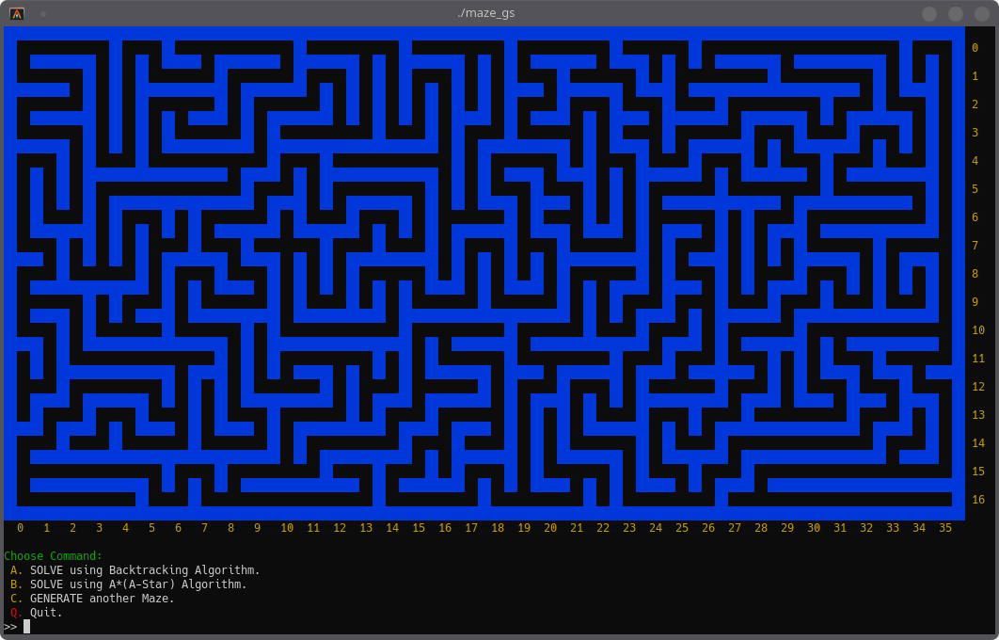
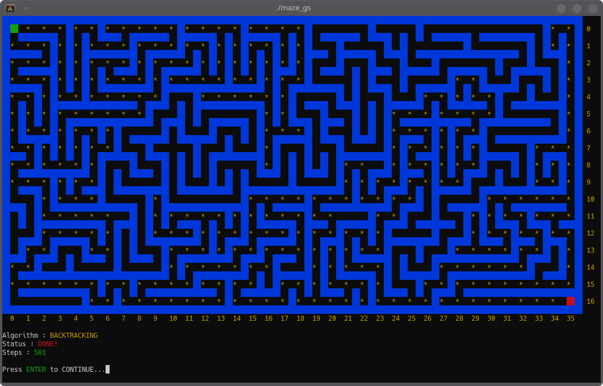
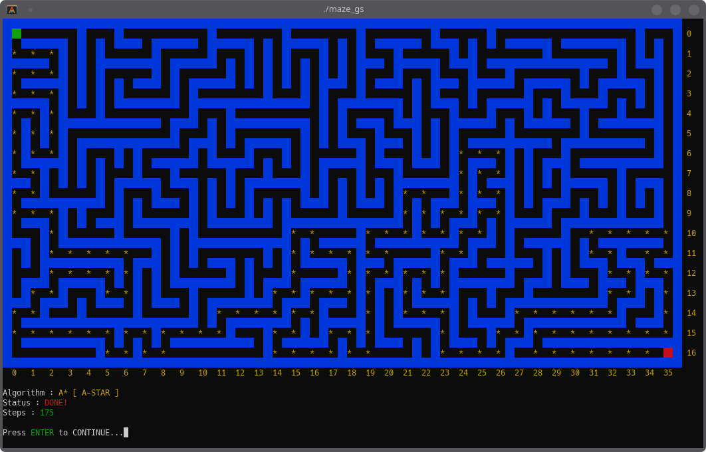

# Maze: Generator-Solver

*Project in Object-Oriented Programming (CPE 515-O)*

## DESCRIPTION
The project is a console application that generates and solves a maze. The generator uses *"Backtracking Algorithm"* and the solver uses two algorithm: *"Backtracking"* and *"A-Star Algorithm"*. For generating a maze, the user is first asked for the maze’s dimension: number of rows and columns or the height and width. For solving the generated maze, the user is asked for a starting point and end point. The points consist of the start and end coordinates or the row and column. The user can select which algorithm to use when solving the generated maze.

## GOALS AND OBJECTIVES
The project aims to create a program that generates a maze using backtracking and solves a maze using *backtracking* and *a-star algorithm*. The project also aims to let the student implement *"Polymorphism"* in the code, inheriting the base class called `Solver` to the derived classes called `Solver_Backtracking` and `Solver_AStar`, each with a different implementation of the virtual function called `solveMaze()`.

## HOW TO:
Build application.
```sh
$ make
```
Launch application.
```sh
$ ./maze_gs
```
Clean.
```sh
$ make clean
```

## SCREENSHOTS:
Generated maze.



Using Backtracking Algorithm.



Using A-Star Algorithm.

